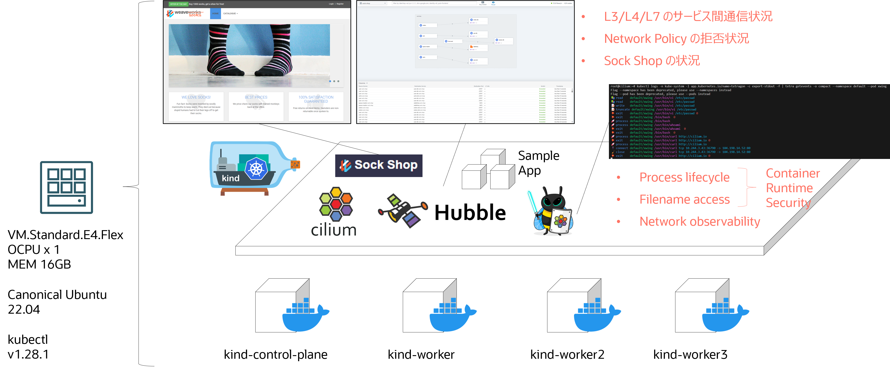

# Oracle Hangout Cafe Season 7 #6 eBPF

セッション時に使用したデモ環境の構築手順および資材置き場です。

環境は、Oracle Cloud Infrastructure（OCI）前提です。

## Get Started 2

デモ環境概要図



コンピュートで以下のインスタンスを作成します。

- Compute
  - VM.Standard.E4.Flex
  - OCPU x 1
  - MEM 16GB
- OS
  - Ubuntu 22.24

構築作業は、root で行います。

```sh
sudo -i
```

### docker install

```sh
apt update
```

```sh
apt install apt-transport-https ca-certificates software-properties-common
```

```sh
curl -fsSL https://download.docker.com/linux/ubuntu/gpg | sudo apt-key add -
```

```sh
add-apt-repository "deb [arch=amd64] https://download.docker.com/linux/ubuntu focal stable"
```

```sh
apt update
```

```sh
apt-cache policy docker-ce
```

```sh
apt install docker-ce
```

```sh
systemctl status docker
```

```sh
docker version
```

```sh
systemctl restart docker
```

### kind install

```sh
[ $(uname -m) = x86_64 ] && curl -Lo ./kind https://kind.sigs.k8s.io/dl/v0.20.0/kind-linux-amd64
```

```sh
chmod +x ./kind
```

```sh
mv ./kind /usr/local/bin/kind
```

### kubectl install

```sh
snap install kubectl --classic
```

```sh
echo 'source <(kubectl completion bash)' >> ~/.bashrc
```

### cilium cluster create

```sh
curl -LO https://raw.githubusercontent.com/cilium/cilium/1.14.2/Documentation/installation/kind-config.yaml
```

```sh
kind create cluster --config=kind-config.yaml
```

```sh
kubectl cluster-info --context kind-kind
```

```sh
CILIUM_CLI_VERSION=$(curl -s https://raw.githubusercontent.com/cilium/cilium-cli/main/stable.txt)
CLI_ARCH=amd64
if [ "$(uname -m)" = "aarch64" ]; then CLI_ARCH=arm64; fi
curl -L --fail --remote-name-all https://github.com/cilium/cilium-cli/releases/download/${CILIUM_CLI_VERSION}/cilium-linux-${CLI_ARCH}.tar.gz{,.sha256sum}
sha256sum --check cilium-linux-${CLI_ARCH}.tar.gz.sha256sum
sudo tar xzvfC cilium-linux-${CLI_ARCH}.tar.gz /usr/local/bin
rm cilium-linux-${CLI_ARCH}.tar.gz{,.sha256sum}
```

```sh
cilium install --version 1.14.2
```

```sh
cilium status --wait
```

```sh
cilium hubble enable
```

```sh
cilium status
```

```sh
cilium hubble port-forward&
```

```sh
HUBBLE_VERSION=$(curl -s https://raw.githubusercontent.com/cilium/hubble/master/stable.txt)
HUBBLE_ARCH=amd64
if [ "$(uname -m)" = "aarch64" ]; then HUBBLE_ARCH=arm64; fi
curl -L --fail --remote-name-all https://github.com/cilium/hubble/releases/download/$HUBBLE_VERSION/hubble-linux-${HUBBLE_ARCH}.tar.gz{,.sha256sum}
sha256sum --check hubble-linux-${HUBBLE_ARCH}.tar.gz.sha256sum
sudo tar xzvfC hubble-linux-${HUBBLE_ARCH}.tar.gz /usr/local/bin
rm hubble-linux-${HUBBLE_ARCH}.tar.gz{,.sha256sum}
```

```sh
hubble status
```

```sh
hubble observe
```

```sh
cilium hubble enable --ui
```

```sh
cilium hubble ui
```

### Sock Shop install

```sh
kubectl create -f https://raw.githubusercontent.com/microservices-demo/microservices-demo/master/deploy/kubernetes/complete-demo.yaml
```

### tetragon install

```sh
helm repo add cilium https://helm.cilium.io
```
```sh
helm repo update
```
```sh
helm install tetragon cilium/tetragon -n kube-system
```
```sh
kubectl rollout status -n kube-system ds/tetragon -w
```

### tetra CLI install

```sh
apt  install golang-go
```

```sh
GOOS=$(go env GOOS)
GOARCH=$(go env GOARCH)
curl -L --remote-name-all https://github.com/cilium/tetragon/releases/latest/download/tetra-${GOOS}-${GOARCH}.tar.gz{,.sha256sum}
sha256sum --check tetra-${GOOS}-${GOARCH}.tar.gz.sha256sum
sudo tar -C /usr/local/bin -xzvf tetra-${GOOS}-${GOARCH}.tar.gz
rm tetra-${GOOS}-${GOARCH}.tar.gz{,.sha256sum}
```

```sh
tetra version
```

### Tetragon Demo

sample source deploy
```sh
kubectl create -f https://raw.githubusercontent.com/cilium/cilium/v1.11/examples/minikube/http-sw-app.yaml
```

#### Process execution

Console A

```sh
kubectl logs -n kube-system -l app.kubernetes.io/name=tetragon -c export-stdout -f | tetra getevents -o compact --namespace default --pod xwing
```
```sh
 process default/xwing /bin/bash
🚀 process default/xwing /usr/bin/whoami
💥 exit    default/xwing /usr/bin/whoami  0
```

Console B

```sh
kubectl exec -it xwing -- /bin/bash
```
```sh
whoami
```

JSON View

```sh
apt install jq
```
```sh
kubectl logs -n kube-system -l app.kubernetes.io/name=tetragon -c export-stdout -f | jq 'select(.process_exec.process.pod.name=="xwing" or .process_exit.process.pod.name=="xwing")'
```

#### Privileged execution

Console A

```sh
kubectl edit cm -n kube-system tetragon-config
# change "enable-process-cred" from "false" to "true"
# change "enable-process-ns" from "false" to "true"
# then save and exit
```

```sh
kubectl rollout restart -n kube-system ds/tetragon
```

```sh
kubectl apply -f https://raw.githubusercontent.com/cilium/tetragon/main/testdata/specs/testpod.yaml
```

Console B

```sh
kubectl logs -n kube-system -l app.kubernetes.io/name=tetragon -c export-stdout -f | tetra getevents -o compact --namespace default --pod test-pod
```
```sh
9/rootfs/sys/devices/virtual/dmi/id/product_uuid 🛑 CAP_SYS_ADMIN
💥 exit    default/test-pod /bin/mount -o ro,bind /run/containerd/io.containerd.runtime.v2.task/k8s.io/5ab17b591d4e679d2b9ba3861b8960c9fd73c2e0d2e097e556dc30921c2093e9/rootfs/product_uuid /run/containerd/io.containerd.runtime.v2.task/k8s.io/5ab17b591d4e679d2b9ba3861b8960c9fd73c2e0d2e097e556dc30921c2093e9/rootfs/sys/devices/virtual/dmi/id/product_uuid 0 🛑 CAP_SYS_ADMIN
💥 exit    default/test-pod /kind/bin/mount-product-files.sh /kind/bin/mount-product-files.sh 0 🛑 CAP_SYS_ADMIN
🚀 process default/test-pod /bin/sleep 365d                🛑 CAP_SYS_ADMIN
```

#### Filename access

Console A

```sh
kubectl apply -f https://raw.githubusercontent.com/cilium/tetragon/main/examples/tracingpolicy/filename_monitoring.yaml
```

```sh
kubectl exec -it xwing -- /bin/bash
```
```sh
vi /etc/passwd
```
```sh
exit
```

Console B

```sh
kubectl logs -n kube-system -l app.kubernetes.io/name=tetragon -c export-stdout -f | tetra getevents -o compact --namespace default --pod xwing
```
```sh
🚀 process default/xwing /usr/bin/vi /etc/passwd                          
📚 read    default/xwing /usr/bin/vi /etc/passwd                          
📚 read    default/xwing /usr/bin/vi /etc/passwd                          
📚 read    default/xwing /usr/bin/vi /etc/passwd                          
📝 write   default/xwing /usr/bin/vi /etc/passwd                          
📝 truncate default/xwing /usr/bin/vi /etc/passwd                         
💥 exit    default/xwing /usr/bin/vi /etc/passwd 0
💥 exit    default/xwing /bin/bash  0
```

```sh
kubectl delete -f https://raw.githubusercontent.com/cilium/tetragon/main/examples/tracingpolicy/filename_monitoring.yaml
```

#### Network observability

Console A

```sh
kubectl apply -f https://raw.githubusercontent.com/cilium/tetragon/main/examples/tracingpolicy/tcp-connect.yaml
```

```sh
kubectl exec -it xwing -- curl http://cilium.io
```

```sh
kubectl delete -f https://raw.githubusercontent.com/cilium/tetragon/main/examples/tracingpolicy/tcp-connect.yaml
```

Console B

```sh
kubectl logs -n kube-system -l app.kubernetes.io/name=tetragon -c export-stdout -f | tetra getevents -o compact --namespace default --pod xwing
```
```sh
🚀 process default/xwing /usr/bin/curl http://cilium.io                   
🔌 connect default/xwing /usr/bin/curl tcp 10.244.3.43:36790 -> 104.198.14.52:80 
🧹 close   default/xwing /usr/bin/curl tcp 10.244.3.43:36790 -> 104.198.14.52:80 
💥 exit    default/xwing /usr/bin/curl http://cilium.io 0
```