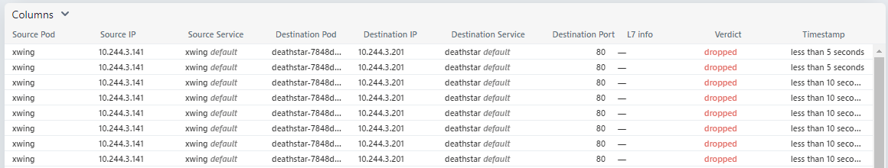

# Oracle Hangout Cafe Season 7 #6 eBPF

セッション時に使用したデモ環境の構築手順および資材置き場です。

環境は、Oracle Cloud Infrastructure（OCI）前提です。

## Get Started 2

デモ環境概要図


コンピュートで以下のインスタンスを作成します。

- Compute
  - VM.Standard.E4.Flex
  - OCPU x 1
  - MEM 16GB
- OS
  - Ubuntu 22.24

構築作業は、root で行います。

```sh
sudo -i
```

### docker install

```sh
apt update
```

```sh
apt install apt-transport-https ca-certificates software-properties-common
```

```sh
curl -fsSL https://download.docker.com/linux/ubuntu/gpg | sudo apt-key add -
```

```sh
add-apt-repository "deb [arch=amd64] https://download.docker.com/linux/ubuntu focal stable"
```

```sh
apt update
```

```sh
apt-cache policy docker-ce
```

```sh
apt install docker-ce
```

```sh
systemctl status docker
```

```sh
docker version
```

```sh
systemctl restart docker
```

### kind install

```sh
[ $(uname -m) = x86_64 ] && curl -Lo ./kind https://kind.sigs.k8s.io/dl/v0.20.0/kind-linux-amd64
```

```sh
chmod +x ./kind
```

```sh
mv ./kind /usr/local/bin/kind
```

### kubectl install

```sh
snap install kubectl --classic
```

```sh
echo 'source <(kubectl completion bash)' >> ~/.bashrc
```

### cilium cluster create

```sh
curl -LO https://raw.githubusercontent.com/cilium/cilium/1.14.2/Documentation/installation/kind-config.yaml
```

```sh
kind create cluster --config=kind-config.yaml
```

```sh
kubectl cluster-info --context kind-kind
```

```sh
CILIUM_CLI_VERSION=$(curl -s https://raw.githubusercontent.com/cilium/cilium-cli/main/stable.txt)
CLI_ARCH=amd64
if [ "$(uname -m)" = "aarch64" ]; then CLI_ARCH=arm64; fi
curl -L --fail --remote-name-all https://github.com/cilium/cilium-cli/releases/download/${CILIUM_CLI_VERSION}/cilium-linux-${CLI_ARCH}.tar.gz{,.sha256sum}
sha256sum --check cilium-linux-${CLI_ARCH}.tar.gz.sha256sum
sudo tar xzvfC cilium-linux-${CLI_ARCH}.tar.gz /usr/local/bin
rm cilium-linux-${CLI_ARCH}.tar.gz{,.sha256sum}
```

```sh
cilium install --version 1.14.2
```

```sh
cilium status --wait
```

```sh
cilium hubble enable
```

```sh
cilium status
```

```sh
cilium hubble port-forward&
```

```sh
HUBBLE_VERSION=$(curl -s https://raw.githubusercontent.com/cilium/hubble/master/stable.txt)
HUBBLE_ARCH=amd64
if [ "$(uname -m)" = "aarch64" ]; then HUBBLE_ARCH=arm64; fi
curl -L --fail --remote-name-all https://github.com/cilium/hubble/releases/download/$HUBBLE_VERSION/hubble-linux-${HUBBLE_ARCH}.tar.gz{,.sha256sum}
sha256sum --check hubble-linux-${HUBBLE_ARCH}.tar.gz.sha256sum
sudo tar xzvfC hubble-linux-${HUBBLE_ARCH}.tar.gz /usr/local/bin
rm hubble-linux-${HUBBLE_ARCH}.tar.gz{,.sha256sum}
```

```sh
hubble status
```

```sh
hubble observe
```

```sh
cilium hubble enable --ui
```

```sh
cilium hubble ui
```

### Cilium & Hubble Demo

サンプルアプリケーションを展開します。

```sh
kubectl create -f https://raw.githubusercontent.com/cilium/cilium/1.14.2/examples/minikube/http-sw-app.yaml
```
```sh
NAME                         READY   STATUS    RESTARTS   AGE
deathstar-7848d6c4d5-4zck4   1/1     Running   0          6s
deathstar-7848d6c4d5-56s9d   1/1     Running   0          6s
tiefighter                   1/1     Running   0          6s
xwing                        1/1     Running   0          5s
```

私用するオブジェクトが Running であることを確認します。

```sh
kubectl get pods,svc
```
```sh
NAME                             READY   STATUS    RESTARTS   AGE
pod/deathstar-7848d6c4d5-4zck4   1/1     Running   0          6m54s
pod/deathstar-7848d6c4d5-56s9d   1/1     Running   0          6m54s
pod/tiefighter                   1/1     Running   0          6m54s
pod/xwing                        1/1     Running   0          6m53s

NAME                 TYPE        CLUSTER-IP      EXTERNAL-IP   PORT(S)   AGE
service/deathstar    ClusterIP   10.96.233.135   <none>        80/TCP    6m54s
service/kubernetes   ClusterIP   10.96.0.1       <none>        443/TCP   5d19h
```

各ノードで展開されている cilium エージェントの Pod 名を確認します。

```sh
kubectl -n kube-system get pods -l k8s-app=cilium -o wide
```
```sh
NAME           READY   STATUS    RESTARTS      AGE     IP           NODE                 NOMINATED NODE   READINESS GATES
cilium-kf87b   1/1     Running   1 (24m ago)   5d19h   172.18.0.3   kind-worker2         <none>           <none>
cilium-kl46t   1/1     Running   1 (24m ago)   5d19h   172.18.0.2   kind-worker3         <none>           <none>
cilium-mhqd9   1/1     Running   1 (24m ago)   5d19h   172.18.0.4   kind-worker          <none>           <none>
cilium-zt76c   1/1     Running   1 (24m ago)   5d19h   172.18.0.5   kind-control-plane   <none>           <none>
```

1つのエージェント Pod 内でネットワークポリシーの状況を確認します。ネットワークポリシーを適用していないため、 Disabled となります。

```sh
kubectl -n kube-system exec cilium-kf87b -- cilium endpoint list
```
```sh
Defaulted container "cilium-agent" out of: cilium-agent, config (init), mount-cgroup (init), apply-sysctl-overwrites (init), mount-bpf-fs (init), clean-cilium-state (init), install-cni-binaries (init)
ENDPOINT   POLICY (ingress)   POLICY (egress)   IDENTITY   LABELS (source:key[=value])                                                  IPv6   IPv4           STATUS   
           ENFORCEMENT        ENFORCEMENT                                                                                                                     
178        Disabled           Disabled          51425      k8s:app.kubernetes.io/name=xwing                                                    10.244.3.205   ready   
                                                           k8s:class=xwing                                                                                            
                                                           k8s:io.cilium.k8s.namespace.labels.kubernetes.io/metadata.name=default                                     
                                                           k8s:io.cilium.k8s.policy.cluster=kind-kind                                                                 
                                                           k8s:io.cilium.k8s.policy.serviceaccount=default                                                            
                                                           k8s:io.kubernetes.pod.namespace=default                                                                    
                                                           k8s:org=alliance                                                                                           
274        Disabled           Disabled          3872       k8s:io.cilium.k8s.namespace.labels.kubernetes.io/metadata.name=sock-shop            10.244.3.53    ready   
                                                           k8s:io.cilium.k8s.policy.cluster=kind-kind                                                                 
                                                           k8s:io.cilium.k8s.policy.serviceaccount=default                                                            
                                                           k8s:io.kubernetes.pod.namespace=sock-shop                                                                  
                                                           k8s:name=user                                                                                              
1034       Disabled           Disabled          18587      k8s:app.kubernetes.io/name=hubble-ui                                                10.244.3.176   ready   
                                                           k8s:app.kubernetes.io/part-of=cilium                                                                       
                                                           k8s:io.cilium.k8s.namespace.labels.kubernetes.io/metadata.name=kube-system                                 
                                                           k8s:io.cilium.k8s.policy.cluster=kind-kind                                                                 
                                                           k8s:io.cilium.k8s.policy.serviceaccount=hubble-ui                                                          
                                                           k8s:io.kubernetes.pod.namespace=kube-system                                                                
                                                           k8s:k8s-app=hubble-ui                                                                                      
1532       Disabled           Disabled          37043      k8s:io.cilium.k8s.namespace.labels.kubernetes.io/metadata.name=sock-shop            10.244.3.172   ready   
                                                           k8s:io.cilium.k8s.policy.cluster=kind-kind                                                                 
                                                           k8s:io.cilium.k8s.policy.serviceaccount=default                                                            
                                                           k8s:io.kubernetes.pod.namespace=sock-shop                                                                  
                                                           k8s:name=front-end                                                                                         
1554       Disabled           Disabled          4          reserved:health                                                                     10.244.3.243   ready   
2505       Disabled           Disabled          65204      k8s:io.cilium.k8s.namespace.labels.kubernetes.io/metadata.name=sock-shop            10.244.3.49    ready   
                                                           k8s:io.cilium.k8s.policy.cluster=kind-kind                                                                 
                                                           k8s:io.cilium.k8s.policy.serviceaccount=default                                                            
                                                           k8s:io.kubernetes.pod.namespace=sock-shop                                                                  
                                                           k8s:name=catalogue                                                                                         
2812       Disabled           Disabled          5072       k8s:io.cilium.k8s.namespace.labels.kubernetes.io/metadata.name=sock-shop            10.244.3.97    ready   
                                                           k8s:io.cilium.k8s.policy.cluster=kind-kind                                                                 
                                                           k8s:io.cilium.k8s.policy.serviceaccount=default                                                            
                                                           k8s:io.kubernetes.pod.namespace=sock-shop                                                                  
                                                           k8s:name=rabbitmq                                                                                          
3372       Disabled           Disabled          1          reserved:host                                                                                      ready
```

xwing と tiefighter Pod から deathstar Pod にアクセスを試みます。ネットワークポリシー適用前なので、「Ship Llanded」と表示されて、xwing と tiefighter Pod は、deathstar Pod にアクセスできます。


```sh
kubectl exec xwing -- curl -s -XPOST deathstar.default.svc.cluster.local/v1/request-landing
```
```sh
Ship landed
```

```sh
kubectl exec tiefighter -- curl -s -XPOST deathstar.default.svc.cluster.local/v1/request-landing
```
```sh
Ship landed
```

hubble でも forwarded の表示を確認できます。


### L4 Policy with Cilium and Kubernetes


L4 ポリシーを適用します。「org=empire」というラベルを持つ tiefighter Pod は、deathstar Pod にアクセスできますが、ラベルを持たない xwing Pod はアクセスできなくなります。

ポリシーの内容は、以下です。

```sh
apiVersion: "cilium.io/v2"
kind: CiliumNetworkPolicy
metadata:
  name: "rule1"
spec:
  description: "L3-L4 policy to restrict deathstar access to empire ships only"
  endpointSelector:
    matchLabels:
      org: empire
      class: deathstar
  ingress:
  - fromEndpoints:
    - matchLabels:
        org: empire
    toPorts:
    - ports:
      - port: "80"
        protocol: TCP
```

CiliumNetworkPolicies は、「endpointSelector」を使用して Pod のラベルを照合し、ポリシーが適用されるソースと宛先を識別します。上記のポリシーは、ラベル (org=empire) を持つポッドからラベル (org=empire、class=deathstar) を持つ deathstar Pod に TCP ポート 80 で送信されるトラフィックをホワイトリストに登録します。

```sh
kubectl create -f https://raw.githubusercontent.com/cilium/cilium/1.14.2/examples/minikube/sw_l3_l4_policy.yaml
```
```sh
ciliumnetworkpolicy.cilium.io/rule1 created
```

想定通り、tiefighter Pod は、deathstar Pod にアクセスできますが、xwing Pod は悪です出来ません。

```sh
kubectl exec tiefighter -- curl -s -XPOST deathstar.default.svc.cluster.local/v1/request-landing
```
```sh
Ship landed
```

アクセスできないため、Ctrl + c で強制終了します。

```sh
kubectl exec xwing -- curl -s -XPOST deathstar.default.svc.cluster.local/v1/request-landing
```

hubble でも dropped と表示されます。


cilium endpoint list を再度実行すると、ラベル org=empire および class=deathstar を持つポッドで、上記のポリシーに従ってイングレス ポリシーの適用が有効になっていいます。

```sh
kubectl -n kube-system exec cilium-kl46t -- cilium endpoint list
```
```sh
Defaulted container "cilium-agent" out of: cilium-agent, config (init), mount-cgroup (init), apply-sysctl-overwrites (init), mount-bpf-fs (init), clean-cilium-state (init), install-cni-binaries (init)
ENDPOINT   POLICY (ingress)   POLICY (egress)   IDENTITY   LABELS (source:key[=value])                                                  IPv6   IPv4           STATUS   
           ENFORCEMENT        ENFORCEMENT                                                                                                                     
13         Disabled           Disabled          12910      k8s:io.cilium.k8s.namespace.labels.kubernetes.io/metadata.name=sock-shop            10.244.1.70    ready   
                                                           k8s:io.cilium.k8s.policy.cluster=kind-kind                                                                 
                                                           k8s:io.cilium.k8s.policy.serviceaccount=default                                                            
                                                           k8s:io.kubernetes.pod.namespace=sock-shop                                                                  
                                                           k8s:name=catalogue-db                                                                                      
240        Enabled            Disabled          10798      k8s:app.kubernetes.io/name=deathstar                                                10.244.1.100   ready   
                                                           k8s:class=deathstar                                                                                        
                                                           k8s:io.cilium.k8s.namespace.labels.kubernetes.io/metadata.name=default                                     
                                                           k8s:io.cilium.k8s.policy.cluster=kind-kind                                                                 
                                                           k8s:io.cilium.k8s.policy.serviceaccount=default                                                            
                                                           k8s:io.kubernetes.pod.namespace=default
・
・＜省略＞
・
```

```sh
kubectl -n kube-system exec cilium-mhqd9 -- cilium endpoint list
```
```sh
Defaulted container "cilium-agent" out of: cilium-agent, config (init), mount-cgroup (init), apply-sysctl-overwrites (init), mount-bpf-fs (init), clean-cilium-state (init), install-cni-binaries (init)
ENDPOINT   POLICY (ingress)   POLICY (egress)   IDENTITY   LABELS (source:key[=value])                                                         IPv6   IPv4           STATUS   
           ENFORCEMENT        ENFORCEMENT                                                                                                                            
86         Enabled            Disabled          10798      k8s:app.kubernetes.io/name=deathstar                                                       10.244.2.91    ready   
                                                           k8s:class=deathstar                                                                                               
                                                           k8s:io.cilium.k8s.namespace.labels.kubernetes.io/metadata.name=default                                            
                                                           k8s:io.cilium.k8s.policy.cluster=kind-kind                                                                        
                                                           k8s:io.cilium.k8s.policy.serviceaccount=default                                                                   
                                                           k8s:io.kubernetes.pod.namespace=default                                                                           
                                                           k8s:org=empire                                                                                                    
・
・＜省略＞
・
```

### L7 Policy with Cilium and Kubernetes


HTTP 対応 L7 ポリシーの適用とテストを行います。

以下のポリシーは、tiefighter Pod からの HTTP POST における /v1/request-landing という URL への API 呼び出しのみを許可し、それ以外は拒否するポリシーです。
適用すると、tiefighter Pod から HTTP PUT における /v1/exhaust-port への通信および xwing Pod からの通信を行いますが、拒否されます。

```sh
apiVersion: "cilium.io/v2"
kind: CiliumNetworkPolicy
metadata:
  name: "rule1"
spec:
  description: "L7 policy to restrict access to specific HTTP call"
  endpointSelector:
    matchLabels:
      org: empire
      class: deathstar
  ingress:
  - fromEndpoints:
    - matchLabels:
        org: empire
    toPorts:
    - ports:
      - port: "80"
        protocol: TCP
      rules:
        http:
        - method: "POST"
          path: "/v1/request-landing"
```

ポリシーを適用します。

```sh
kubectl apply -f https://raw.githubusercontent.com/cilium/cilium/1.14.2/examples/minikube/sw_l3_l4_l7_policy.yaml
```
```sh
ciliumnetworkpolicy.cilium.io/rule1 configured
```

HTTP POST 通信は通りますが、HTTP PUT 通信は拒否されます。

```sh
kubectl exec tiefighter -- curl -s -XPOST deathstar.default.svc.cluster.local/v1/request-landing
```
```sh
Ship landed
```

```sh
kubectl exec tiefighter -- curl -s -XPUT deathstar.default.svc.cluster.local/v1/exhaust-port
```
```sh
Access denied
```

hubble でも両方の状況を確認できます。


ラベル org=empire のない Pod からのトラフィックは引き続き Dropped となります。

```sh
kubectl exec xwing -- curl -s -XPOST deathstar.default.svc.cluster.local/v1/request-landing
```



サンプルアプリケーションとネットワークポリシーを削除します。

```sh
kubectl delete -f https://raw.githubusercontent.com/cilium/cilium/1.14.2/examples/minikube/http-sw-app.yaml
```
```sh
service "deathstar" deleted
deployment.apps "deathstar" deleted
pod "tiefighter" deleted
pod "xwing" deleted
```
```sh
kubectl delete cnp rule1
```
```sh
ciliumnetworkpolicy.cilium.io "rule1" deleted
```

### Monitoring of Sock Shop by Hubble

### Sock Shop install

```sh
kubectl create -f https://raw.githubusercontent.com/microservices-demo/microservices-demo/master/deploy/kubernetes/complete-demo.yaml
```
```sh
namespace/sock-shop created
Warning: spec.template.spec.nodeSelector[beta.kubernetes.io/os]: deprecated since v1.14; use "kubernetes.io/os" instead
deployment.apps/carts created
service/carts created
deployment.apps/carts-db created
service/carts-db created
deployment.apps/catalogue created
service/catalogue created
deployment.apps/catalogue-db created
service/catalogue-db created
deployment.apps/front-end created
service/front-end created
deployment.apps/orders created
service/orders created
deployment.apps/orders-db created
service/orders-db created
deployment.apps/payment created
service/payment created
deployment.apps/queue-master created
service/queue-master created
deployment.apps/rabbitmq created
service/rabbitmq created
deployment.apps/session-db created
service/session-db created
deployment.apps/shipping created
service/shipping created
deployment.apps/user created
service/user created
deployment.apps/user-db created
service/user-db created
```

### Port-forward Sock Shop

ポートフォワーディングするために front-end Pod 名を調べます。

```sh
kubectl get pods -n sock-shop
```
```sh
NAME                            READY   STATUS    RESTARTS   AGE
carts-5bb979cb6d-mkrmw          1/1     Running   0          11m
carts-db-6d88679f9d-qhwjx       1/1     Running   0          11m
catalogue-7c89c4b8b7-ktt8m      1/1     Running   0          11m
catalogue-db-6d76c95d76-ps2cs   1/1     Running   0          11m
front-end-5d7b595bcd-2crfh      1/1     Running   0          11m
orders-d5f745cc6-k7bvm          1/1     Running   0          11m
orders-db-688cc755dd-bh7rw      1/1     Running   0          11m
payment-66d9c6c5c8-czxqm        1/1     Running   0          11m
queue-master-78b6f85bb7-k65pd   1/1     Running   0          11m
rabbitmq-55c946cb56-zfcpk       2/2     Running   0          11m
session-db-9dc55b5b-fb7gh       1/1     Running   0          11m
shipping-78db6c6958-t5j74       1/1     Running   0          11m
user-5c8d59bcd4-pv6w7           1/1     Running   0          11m
user-db-758477f574-q6ztz        1/1     Running   0          11m
```

front-end Pod のコンテナポート番号は、8079 なので、そのポート番号でフォワーディングします。
新しいコンソールを起動して実行します。

```sh
kubectl port-forward front-end-5d7b595bcd-2crfh -n sock-shop 8079:8079
```
```sh
Forwarding from 127.0.0.1:8079 -> 8079
Forwarding from [::1]:8079 -> 8079
Handling connection for 8079
・
・
・
```

VSCodeでポート設定をすると、自動でブラウザが起動して、以下のURLにアクセスします。

http://localhost:8079/


http://localhost:12000/ hubble ui で sock-shop をクリックするとリアルタイムの状況を確認できます。


## Get Started 3

### Helm install

```sh
curl -fsSL -o get_helm.sh https://raw.githubusercontent.com/helm/helm/main/scripts/get-helm-3
```

```sh
chmod 700 get_helm.sh
```

```sh
./get_helm.sh
```

### tetragon install

```sh
helm repo add cilium https://helm.cilium.io
```
```sh
helm repo update
```
```sh
helm install tetragon cilium/tetragon -n kube-system
```
```sh
kubectl rollout status -n kube-system ds/tetragon -w
```

### tetra CLI install

```sh
apt  install golang-go
```

```sh
GOOS=$(go env GOOS)
GOARCH=$(go env GOARCH)
curl -L --remote-name-all https://github.com/cilium/tetragon/releases/latest/download/tetra-${GOOS}-${GOARCH}.tar.gz{,.sha256sum}
sha256sum --check tetra-${GOOS}-${GOARCH}.tar.gz.sha256sum
sudo tar -C /usr/local/bin -xzvf tetra-${GOOS}-${GOARCH}.tar.gz
rm tetra-${GOOS}-${GOARCH}.tar.gz{,.sha256sum}
```

```sh
tetra version
```

### Tetragon Demo

#### Process execution


Console A

```sh
kubectl logs -n kube-system -l app.kubernetes.io/name=tetragon -c export-stdout -f | tetra getevents -o compact --namespace default --pod xwing
```
```sh
 process default/xwing /bin/bash
🚀 process default/xwing /usr/bin/whoami
💥 exit    default/xwing /usr/bin/whoami  0
```

Console B

```sh
kubectl exec -it xwing -- /bin/bash
```
```sh
whoami
```
```sh
exit
```

JSON View

```sh
apt install jq
```
```sh
kubectl logs -n kube-system -l app.kubernetes.io/name=tetragon -c export-stdout -f | jq 'select(.process_exec.process.pod.name=="xwing" or .process_exit.process.pod.name=="xwing")'
```

#### Privileged execution


Console A

```sh
kubectl edit cm -n kube-system tetragon-config
# change "enable-process-cred" from "false" to "true"
# change "enable-process-ns" from "false" to "true"
# then save and exit
```

```sh
kubectl rollout restart -n kube-system ds/tetragon
```

```sh
kubectl apply -f https://raw.githubusercontent.com/cilium/tetragon/main/testdata/specs/testpod.yaml
```

Console B

```sh
kubectl logs -n kube-system -l app.kubernetes.io/name=tetragon -c export-stdout -f | tetra getevents -o compact --namespace default --pod test-pod
```
```sh
9/rootfs/sys/devices/virtual/dmi/id/product_uuid 🛑 CAP_SYS_ADMIN
💥 exit    default/test-pod /bin/mount -o ro,bind /run/containerd/io.containerd.runtime.v2.task/k8s.io/5ab17b591d4e679d2b9ba3861b8960c9fd73c2e0d2e097e556dc30921c2093e9/rootfs/product_uuid /run/containerd/io.containerd.runtime.v2.task/k8s.io/5ab17b591d4e679d2b9ba3861b8960c9fd73c2e0d2e097e556dc30921c2093e9/rootfs/sys/devices/virtual/dmi/id/product_uuid 0 🛑 CAP_SYS_ADMIN
💥 exit    default/test-pod /kind/bin/mount-product-files.sh /kind/bin/mount-product-files.sh 0 🛑 CAP_SYS_ADMIN
🚀 process default/test-pod /bin/sleep 365d                🛑 CAP_SYS_ADMIN
```

#### Filename access


Console A

```sh
kubectl apply -f https://raw.githubusercontent.com/cilium/tetragon/main/examples/tracingpolicy/filename_monitoring.yaml
```

```sh
kubectl exec -it xwing -- /bin/bash
```
```sh
vi /etc/passwd
```
```sh
exit
```

Console B

```sh
kubectl logs -n kube-system -l app.kubernetes.io/name=tetragon -c export-stdout -f | tetra getevents -o compact --namespace default --pod xwing
```
```sh
🚀 process default/xwing /usr/bin/vi /etc/passwd                          
📚 read    default/xwing /usr/bin/vi /etc/passwd                          
📚 read    default/xwing /usr/bin/vi /etc/passwd                          
📚 read    default/xwing /usr/bin/vi /etc/passwd                          
📝 write   default/xwing /usr/bin/vi /etc/passwd                          
📝 truncate default/xwing /usr/bin/vi /etc/passwd                         
💥 exit    default/xwing /usr/bin/vi /etc/passwd 0
💥 exit    default/xwing /bin/bash  0
```

JSON View

※Crt ＋C 実行後

```sh
kubectl logs -n kube-system -l app.kubernetes.io/name=tetragon -c export-stdout -f | jq 'select(.process_kprobe.process.pod.name=="xwing" or .process_kprobe.process.pod.name=="xwing")'
```

Console A

TracingPolicy を削除します。

```sh
kubectl delete -f https://raw.githubusercontent.com/cilium/tetragon/main/examples/tracingpolicy/filename_monitoring.yaml
```

#### Network observability


Console A

```sh
kubectl apply -f https://raw.githubusercontent.com/cilium/tetragon/main/examples/tracingpolicy/tcp-connect.yaml
```

```sh
kubectl exec -it xwing -- curl http://cilium.io
```

Console B

```sh
kubectl logs -n kube-system -l app.kubernetes.io/name=tetragon -c export-stdout -f | tetra getevents -o compact --namespace default --pod xwing
```
```sh
🚀 process default/xwing /usr/bin/curl http://cilium.io                   
🔌 connect default/xwing /usr/bin/curl tcp 10.244.3.43:36790 -> 104.198.14.52:80 
🧹 close   default/xwing /usr/bin/curl tcp 10.244.3.43:36790 -> 104.198.14.52:80 
💥 exit    default/xwing /usr/bin/curl http://cilium.io 0
```

JSON View

※Crt ＋C 実行後

```sh
kubectl logs -n kube-system -l app.kubernetes.io/name=tetragon -c export-stdout -f | jq 'select(.process_kprobe.process.pod.name=="xwing" or .process_kprobe.process.pod.name=="xwing")'
```

Console A

TracingPolicy を削除します。

```sh
kubectl delete -f https://raw.githubusercontent.com/cilium/tetragon/main/examples/tracingpolicy/tcp-connect.yaml
```

